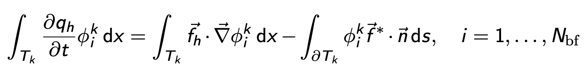
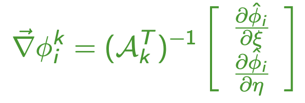
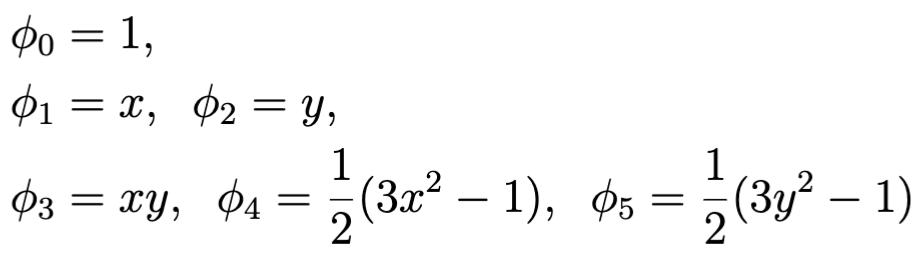
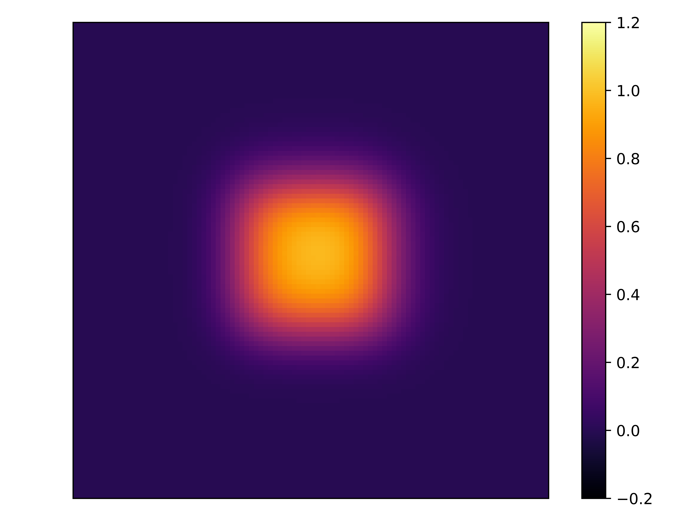
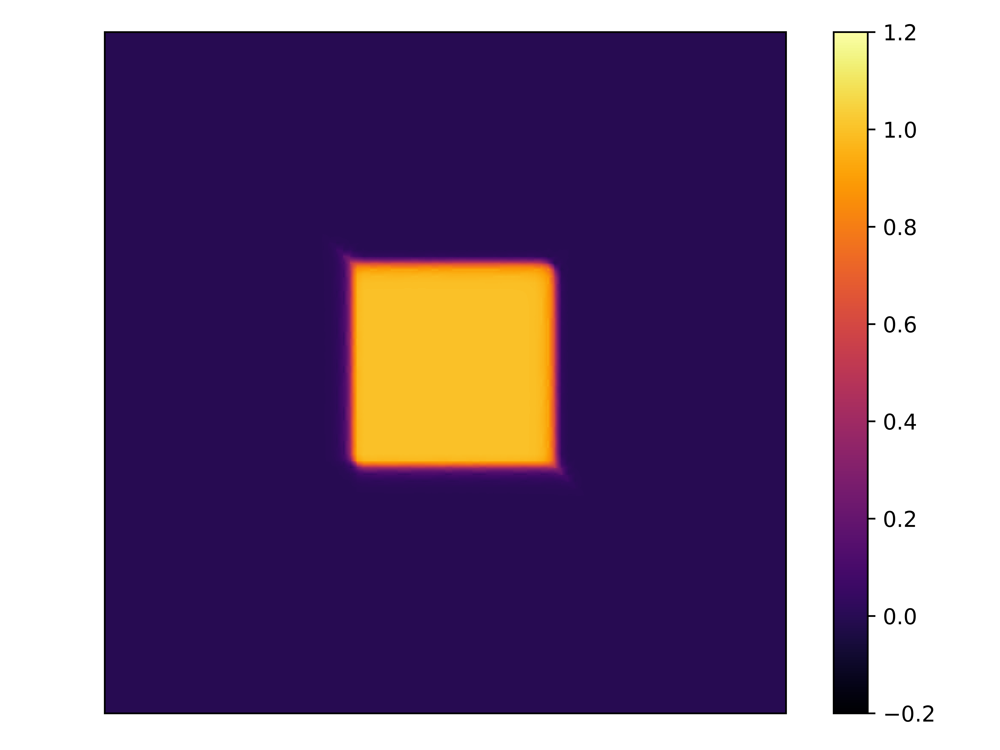
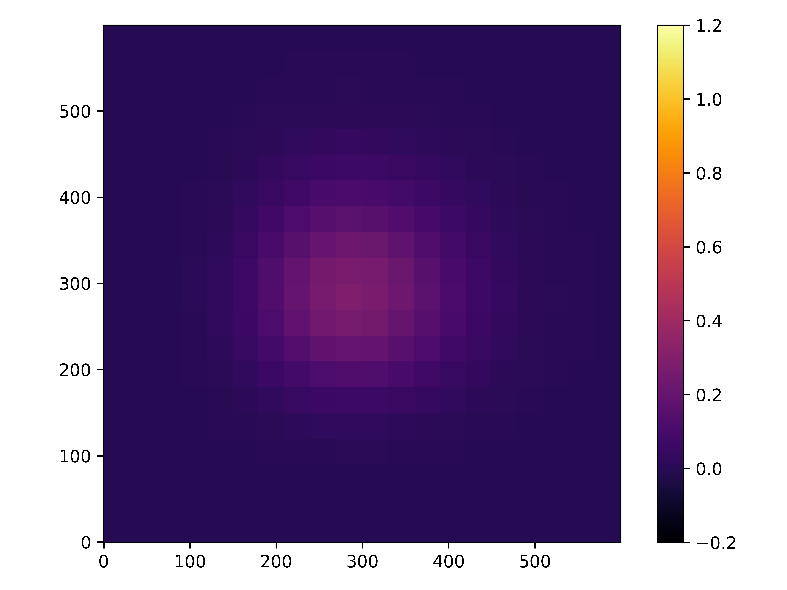
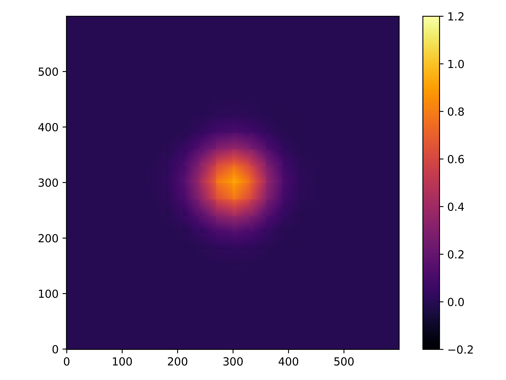
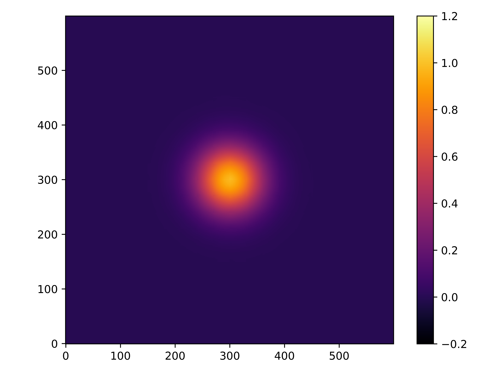
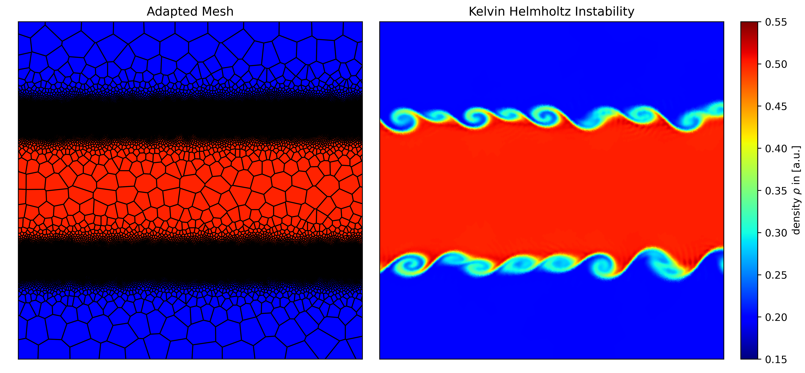

# hydro_bsc_project
Project to do hydrodynamics on cartesian and voronoi meshes. Includes Finite Volume MUSCL solver for shallow water and euler equations. Next steps are towards Discontinous Galerkin methods. Work in progress...

### Summary of last weeks meeting
---
#### Rayleigh Taylor instability
fixed initial conditions: P in hydrostatic equilibrium

  

---
#### 1D DG scalar upwind advection
for arbitrary Np and monomial basisfunctions in C++ using Eigen library

  

#### Slope limiting

  

  
  

### L1-error of advected step function

  

  

- slope limiting again limits higher order methods to first order convergence at discontinuities and also limits the benefit of having higher order polynomials (e.g. compare Np = 1 vs Np = 2)
---
### This week: 2D DG Scalar upwind advection
In general the integrals stay roughly the same

  

flux terms replaced with flux line integral. Partial derivative replaced with Gradient.
Also the projection here now is a (in our case diagonal) matrix instead of a coefficient. Need to respect that when changing into reference element.

  

using basis functions as in [[Schaal, K. 2016]](http://www.kmschaal.de/PhDThesis_KevinSchaal.pdf). First few legendre polynomials are

  

use product of legendre polynomials as basis functions. This leads to 

  

three different options implemented:
N_p = 0 : phi 0
N_p = 1: phi 0 to 3
N_p = 2: phi 0 to 5

#### Implementation
N_p = 0 and N_p = 1 of square without slope limiting on a 20x20 grid

  
  

slope limited versions for N_p = 0, N_p = 1, N_p = 2 on a 100x100 grid

  
  
  

for the slope limiting it seems again that the higher order advantages get lost here (i.e almost no difference between second and third order) since effectively everything is limited to linear elements.

---
For smooth solutions without an active limiter the improvements are way more obvious since the limiting is not reducing the order here.

not slope limited gaussian for N_p = 0, N_p = 1, N_p = 2 on a 20x20 grid

  
  
  

--- 
### Side project for FV euler: Airfoil
Thought that it just might be a cool idea to add an airfoil as another test scenario for the FV code (along KH, RT and Shock tube).

Plotted for different angles of attack. Colormap is pressure. Arrows give flow direction. Clearly for to high angles of attack the plane stalls.

  

---
### other
- Who should we ask as a second examiner for the bachelor kolloquium?
- Decide on Plot style, x and y direction for the 2D plots or leave it completely?

  
  

---
### next?
- add plot routines for DG from notebook to vis_tk
- change element wise calculation of M_ij and S_ij to one single global calculation
- Do the L1 error also for 2D and especially for the gaussian shape as well -> hopefully we see that for the smooth solutions the convergence is way better? would show that one needs more advanced slope limiters and better oscillation detection to benefit from higher order method
- For that we need to implement proper initial conditions using L2 projection and solving the integral there using gauss quadrature

further ideas?