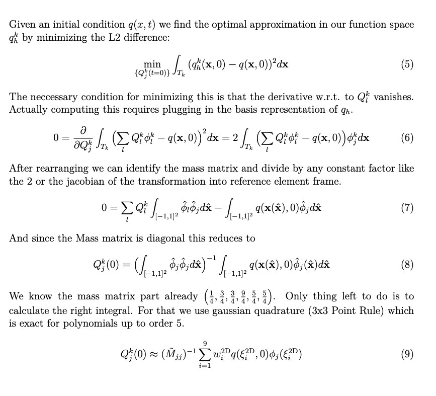
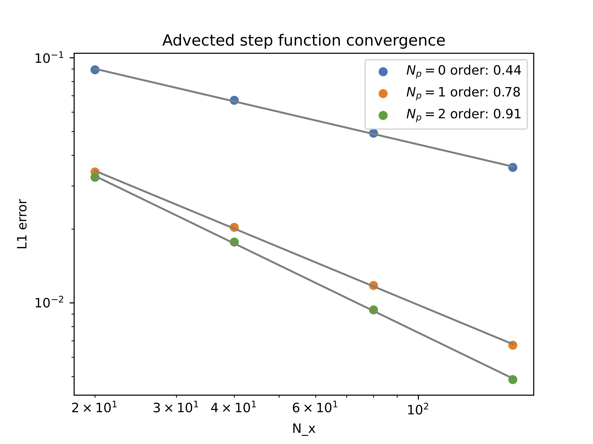
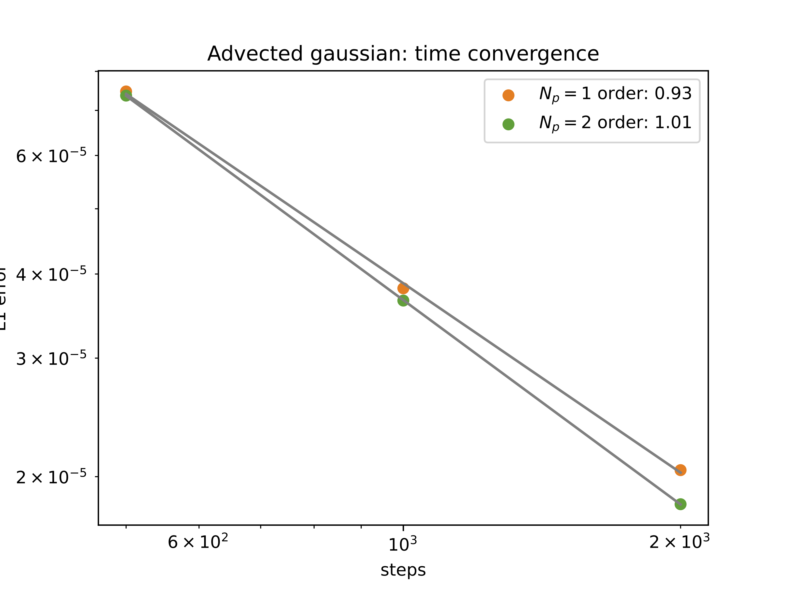
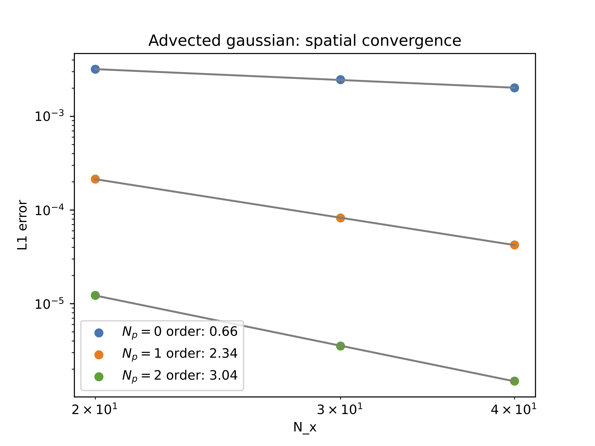
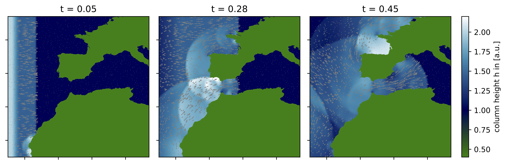
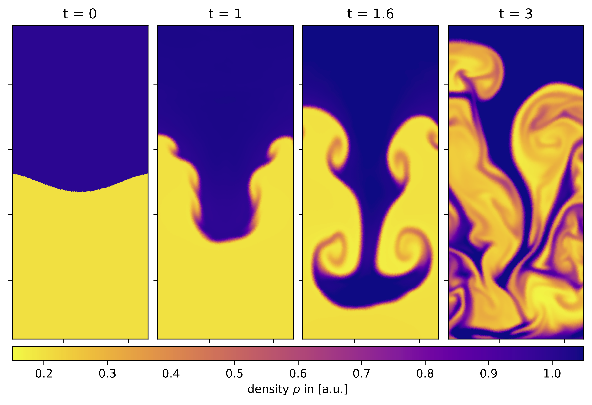

# hydro_bsc_project
Project to do hydrodynamics on cartesian and voronoi meshes. Includes Finite Volume MUSCL solver for shallow water and euler equations. Also includes a 2D scalar upwind advection Discontinous Galerkin solver. Work in progress...

### Weekly update
---
- rasterization zorder option for 2D plots
- python code cleanup into vis_tk package:
  - functions to generate custom inner boundaries (airfoil, circle, .shp files like africa)
  - 1D DG plotting and L1 routines
  - 2D DG plotting routines
- calculating M_ij and S_ij + flux matricies once instead of every timestep for every cell, storage still cell wise for generality

### L1 errors 2D
- implemented 2D L1 error calculation for step function and gaussian but easily generalizable
  -> for single file, over time, over N
- proper initial conditions using L2 projection -> need gaussian quadrature for that

  

  

#### Convergence for slope limited step function
using beta = 2 (so allowing twice of tvd)

  

just as with euler muscl scheme the slope limiting limits everything to 1st order or lower

#### Convergence for smooth gaussian without slope limiting
to see the higher order convergence here we need to look at spatial convergence and temporal convergence seperately:

since we use forward euler time integration the temporal convergence is roughly linear

  

we archieve this plot by going to very high spatial resolution such that the spatial error is negligible and then varying dt for constant N_row

the spatial convergence should be given by the order of our DG scheme

  

we archieve this plot by doing very very small time steps such that the temporal error is negligible and we dont see effects of the only linearly scaling forward euler. 

-> For a practically usable higher order scheme one should improve the time integration to the same order of the DG scheme since the lowest order limits the overall order.

### New custom boundary for SWE: Africa + Europe
- SWE dam break onto gibraltar strait (not to scale) / africa + europe

  

### other
started doing some plots for thesis with "final" plot style i guess

  

  

  

# next
i guess just start writing the thesis i guess?
any further wishes/ideas?