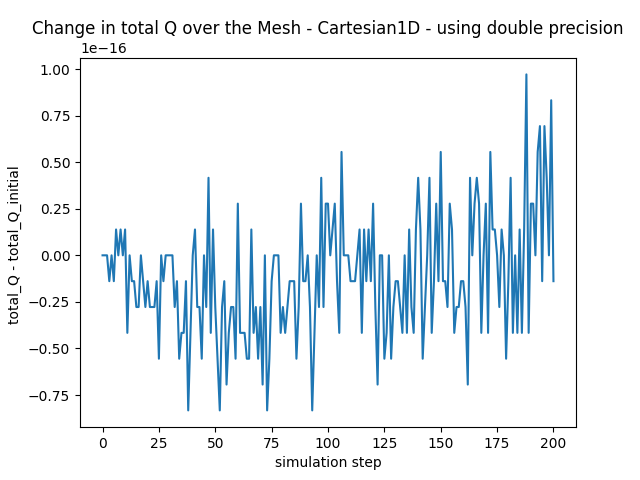
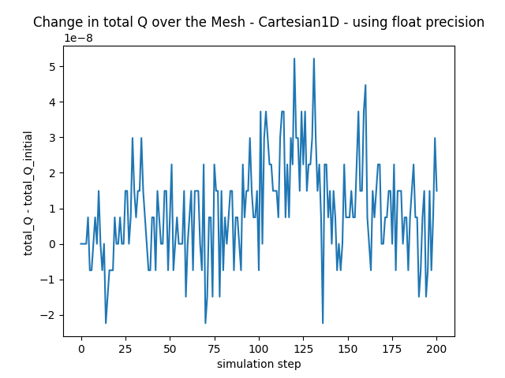
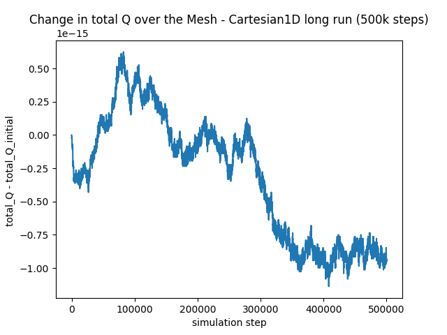
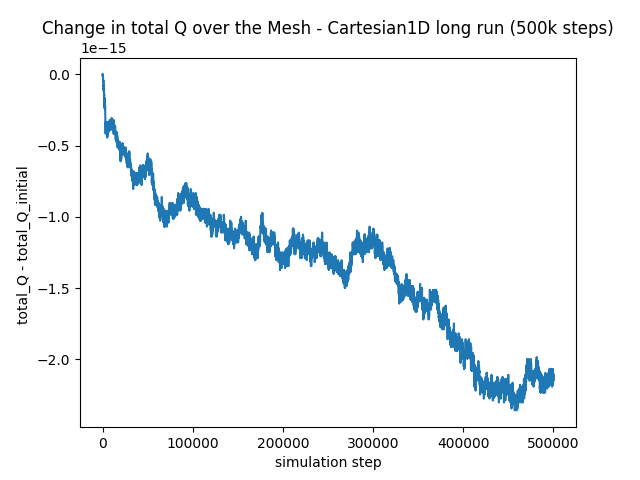
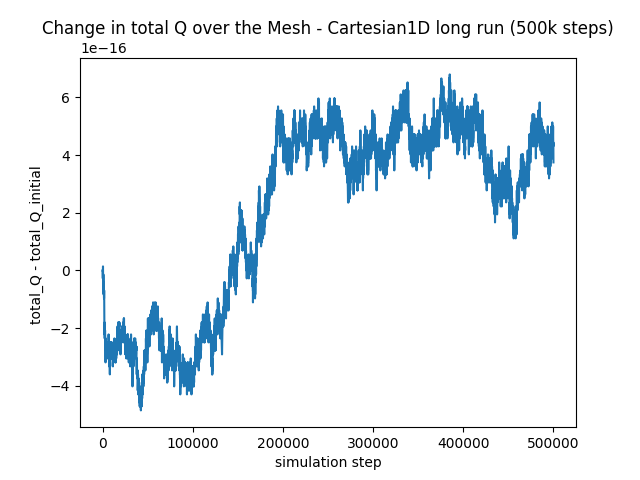
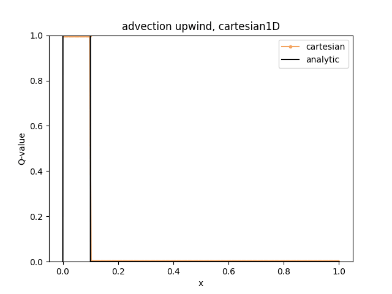
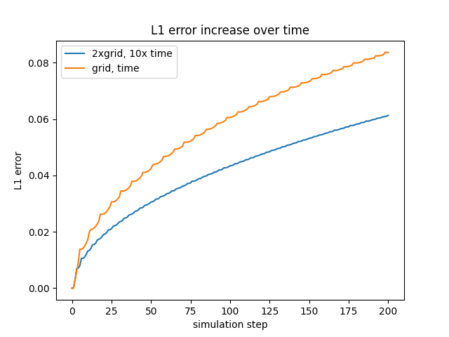
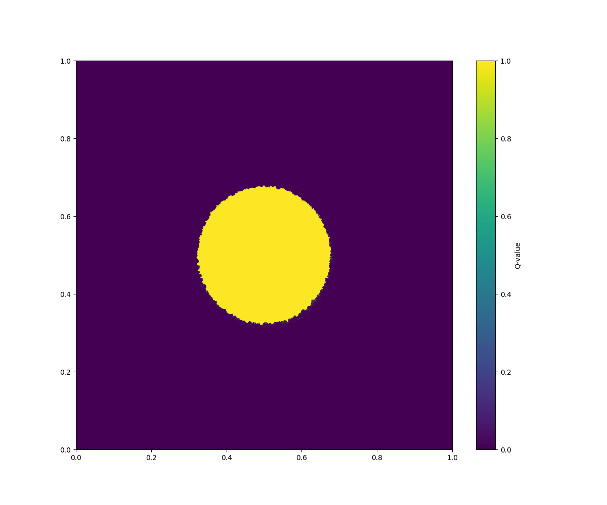
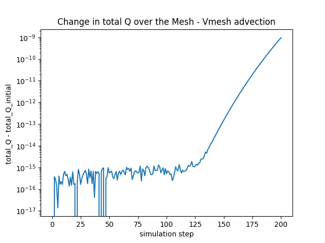

# hydro_bsc_project
project to eventually do hydrodynamics on different meshes, with maybe different physics and different solvers. still work in progress...

## Changes in last update
---
### 1. Structural updates

- instead of multiple vectors for different cell types and different adaptation functions code is now using **templates** for Mesh and Solver as well as **const expressions** to access members of different cell types in the same function (e.g. useful while saving mesh where the function changes only slightly for different cell types)

Mesh.h :
```cpp
template <typename CellType>
class Mesh {
  
  Mesh<CellType>();
  ~Mesh<CellType>();
  vector<CellType> cells;
//...
}
```
Mesh.tpp :
```cpp
// compile this part only for correct cell type
if constexpr (is_same_v<CellType, Q_Cell>) {
  output_file << cells[i].Q;
}
```

- removed some redundancy in savings structure 
- added option for total_Q calculation to interpret Q as absolute value or density -> fixes total_Q_conservation depending on using diffusion_like (conserves sum(Q)) or advection (conserves sum(Q*cell_volume)).

Mesh.tpp :
```cpp
// calculate total_Q summed up over mesh 
//(depending on wether it is a density multiply with volume) 
if (is_density) {
    for (int i = 0; i < cells.size(); i++) {
        total_Q += cells[i].getQ()*cells[i].volume;
    }
} else {
    for (int i = 0; i < cells.size(); i++) {
        total_Q += cells[i].getQ();
    }
}
```
---
### 2. Plots
- Plot to compare the numerical errors between float and double precision for the advection. As one can see the error for float precision around $10^{-8}$ and for double precision around $10^{-16} = (10^{-8})^2$ as expected.

<p align="center">
  
  
</p>

- Since at this number of simulation steps the error seems random like the next plots show the Q conseravtion error for way more simulation steps (500k). Here one can see, that there is some kind of systematic change to the error. This systematic deviation however is very sensitive to initial condition and not in any predictable direction. Also the deviation is still quite small (~$10^{-15}$) even for many simulation steps. So i guess no concern?

<p align="center">
  
  
  
</p>

- To better quantify the numerical error the numerical caluclation and analytical solution for the 1D advection are shown from which the L1 error is calculated.

$$ L_1 = \frac{1}{N}\sum^{N}_{i = 1}{|f_i - u_i|} $$

with $N$ the number of data points, $f_i$ the analytical solution for data point $i$ and $u_i$ the numerical solution.
As one can see the error in this specific scenario increases roughly log like with time while the spikes are resolution effects. Also higher time and/or spatial resolution leads to smaller errors.

<p align="center">
  
  
</p>

---
### 3. Advection on Voronoi Mesh
or any mesh in general, using finite volume upwind scheme.
FV method:

$$ Q_i^{(n+1)} = Q_i^{(n)} - \frac{\Delta t}{\Delta V}\int{\vec{F}\cdot \vec{ds}}$$

For voronoi cells $i$ with faces $j$ the integral simplifies to a sum. The Flux for advection in an upwind scheme is given by $F_j = v_{eff} \cdot Q_{upwind}$ where $Q_{upwind}$ is either $Q_i$ or the neighbouring $Q_j$ depending on sign of $v_{eff}$ with $v_{eff} = \vec{v} \cdot \vec{n}$ where $\vec{n}$ is the normal vector to the face. This leads to

$$ Q_i^{(n+1)} = Q_i^{(n)} - \frac{\Delta t}{\Delta V}\sum_{j\in N(i)}{v_{eff, j} \cdot Q_{upwind}\cdot l_{j}}$$

with $l_{j}$ the length of that face.

Solver.tpp :
```cpp
//...
  if (v_eff>=0) {
    total_Flux += v_eff * Q_i_n * l_ij;
  } else {
    total_Flux += v_eff * Q_j_n * l_ij;
  }
}

Q_i_np1 = Q_i_n - dt/dV *(total_Flux);
```

For an initial circle and $v = (0.5, 0.3)$ we get: 
<p align="center">
  
</p>

total_Q (density) seems to be conserved here quite well (~$10^{-15}$) until the first parts of the numerical diffusion reach the border and are advected over it

<p align="center">
  
</p>

--- 
