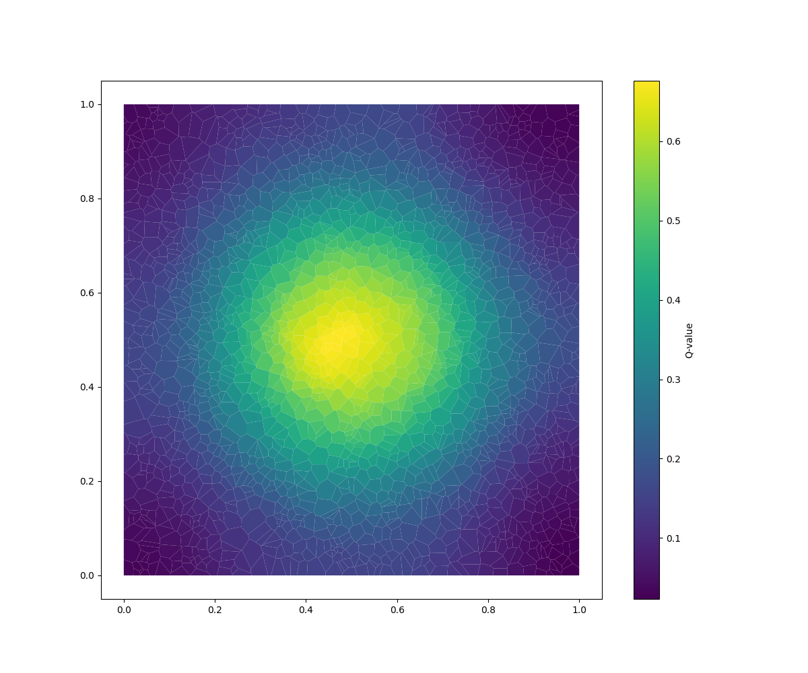
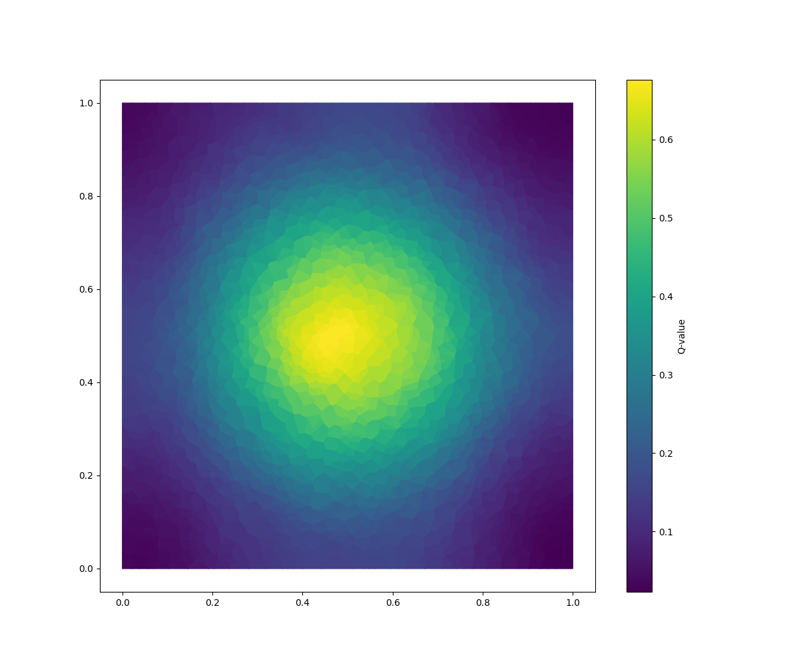
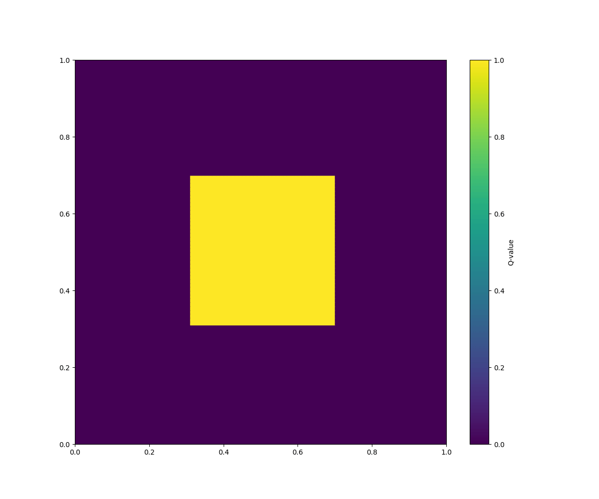
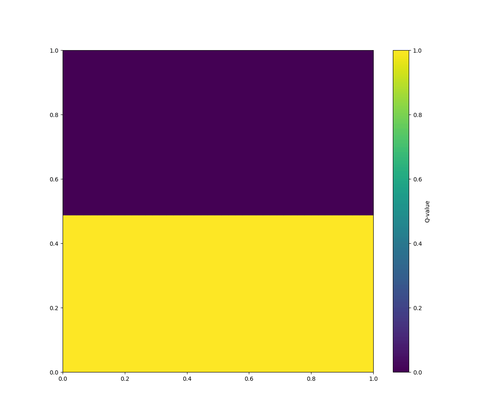
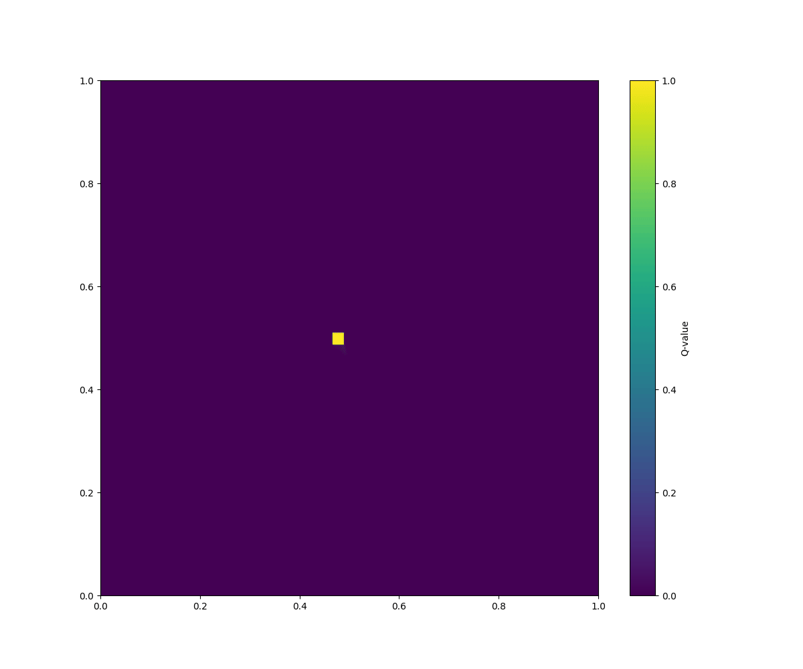
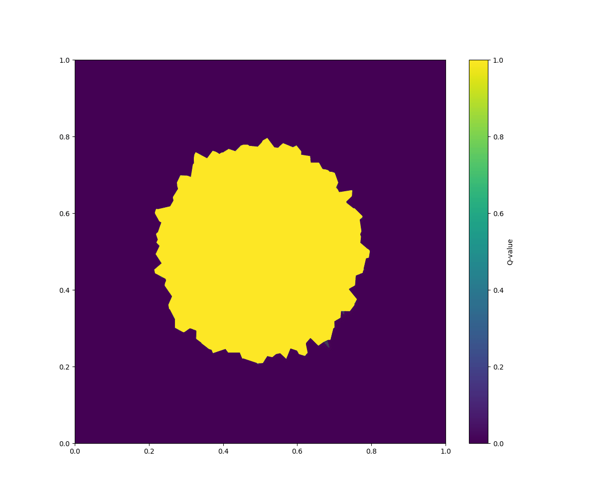
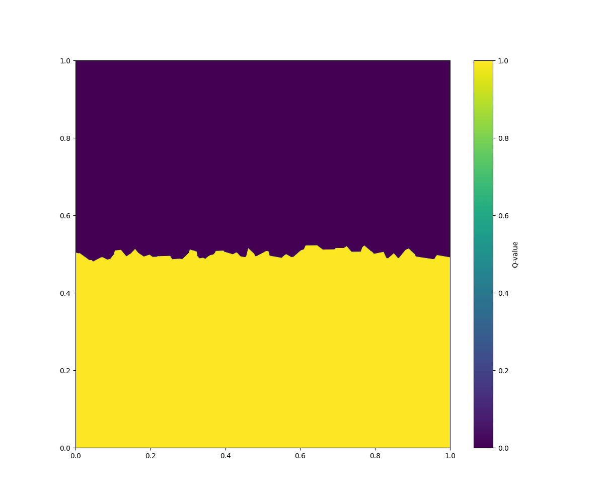
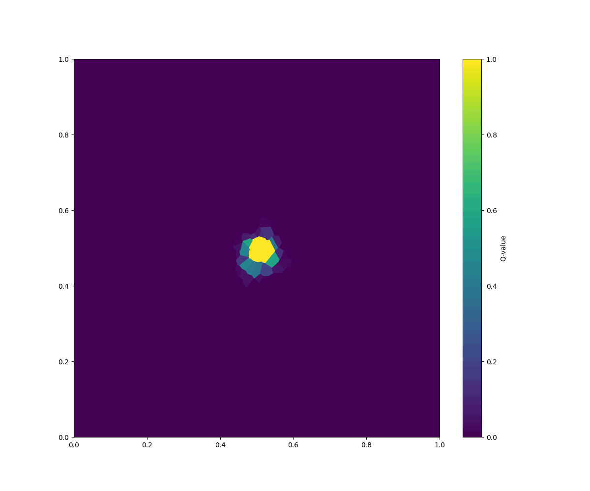

# hydro_bsc_project
project to eventually do hydrodynamics on different meshes, with maybe different physics and different solvers. still work in progress...

### Todos:
- further todos will be placed here

### Edges "none" or "face"

  
  

- "none": with white borders leads to rendering issues for to many cells 
- "faces": no borders

### Cartesian Mesh

  
  
  

1. initial square with 10k cells
2. initial one half filled with 2k cells
3. continuous input in one cell on a 2k cell grid

### Vornoi Mesh

  
  
  

1. initial circle with 2k cells
2. initial one half filled with 2k cells
3. continuous input in one cell on a 2k cell grid