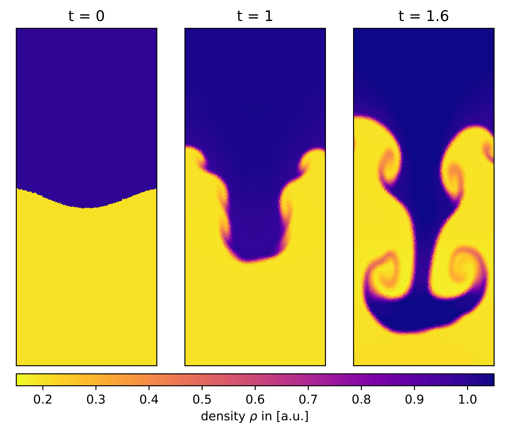
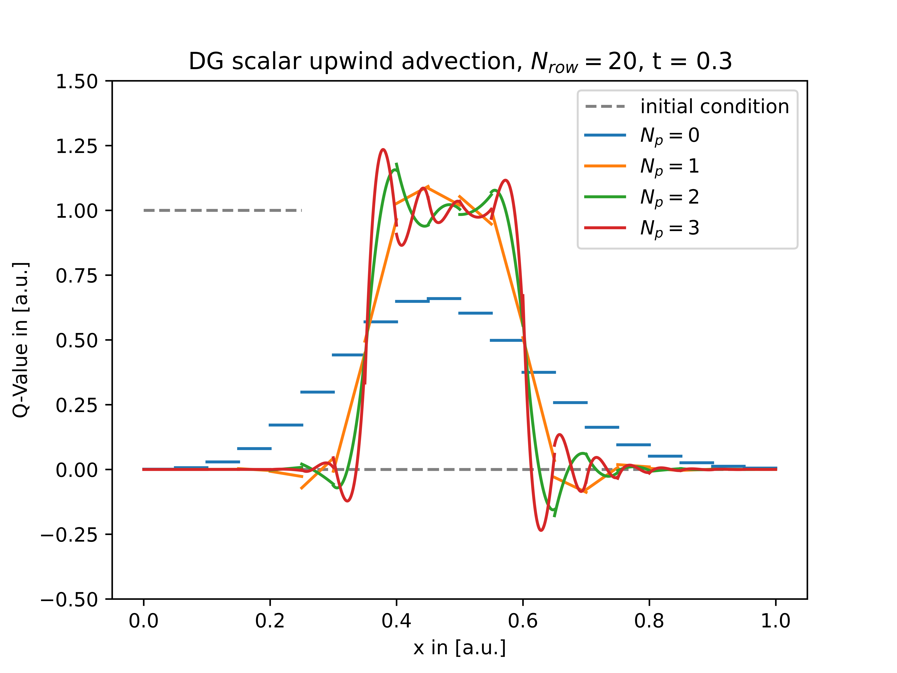
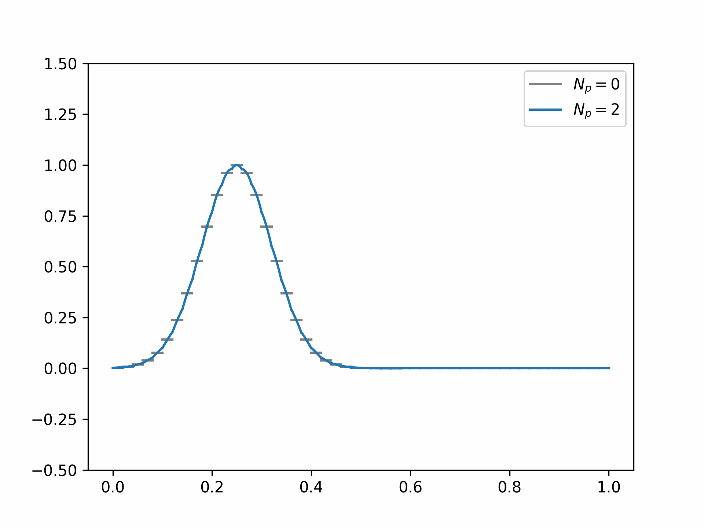
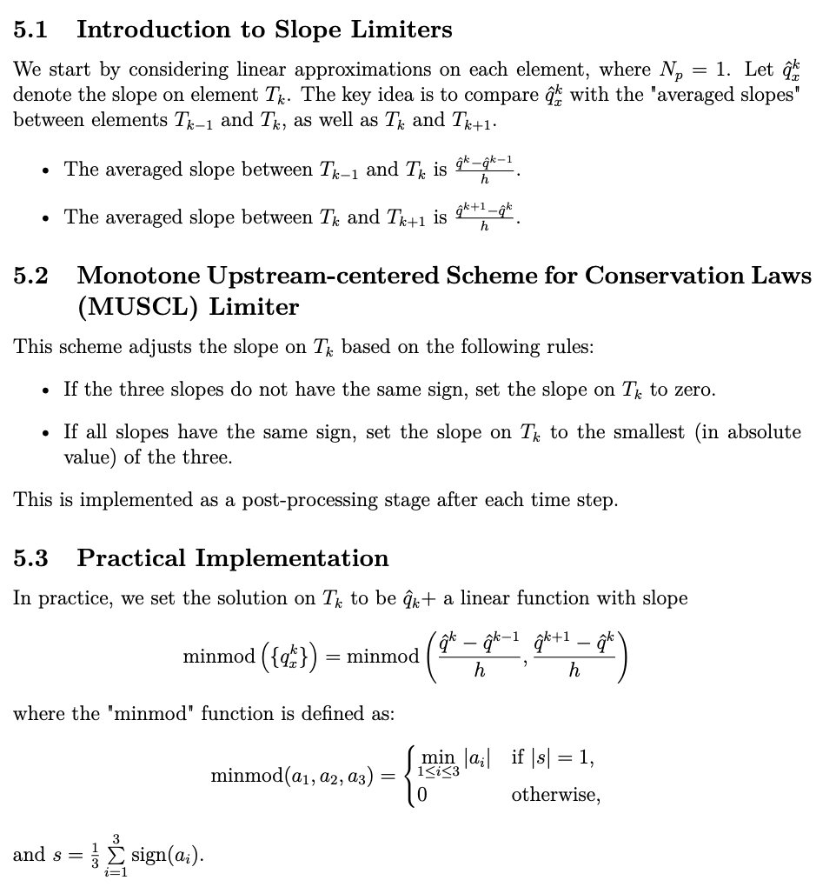
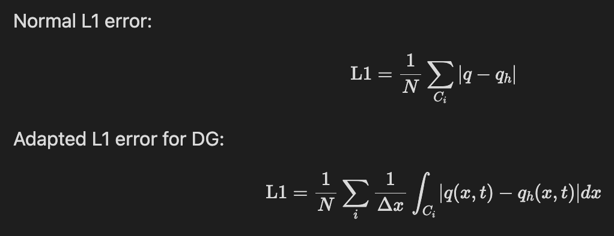
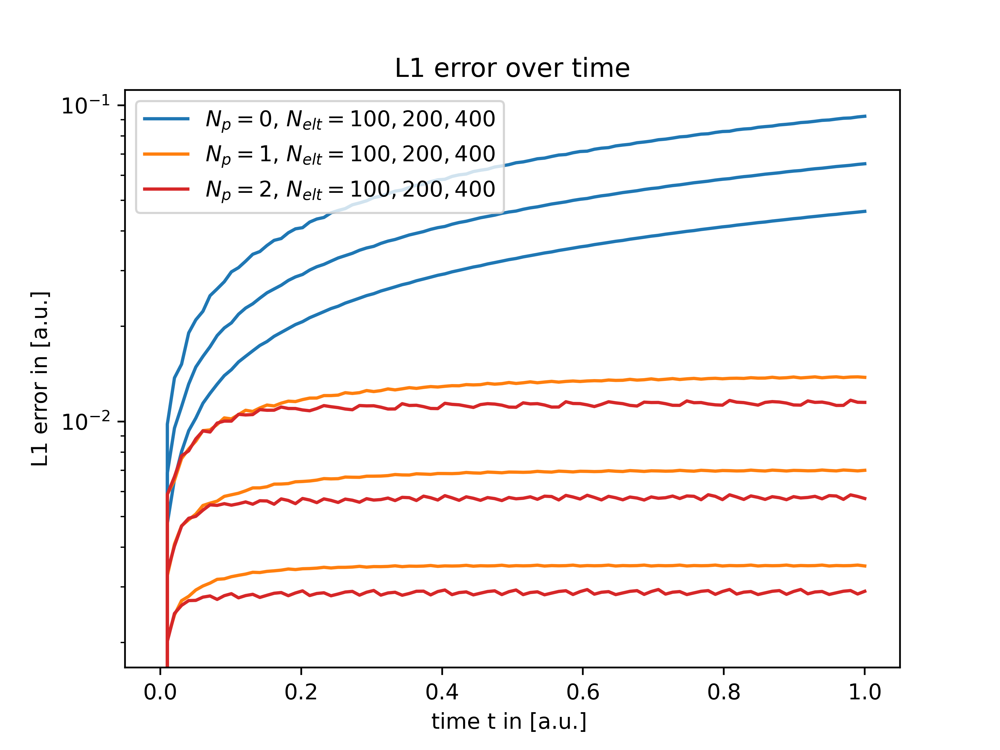
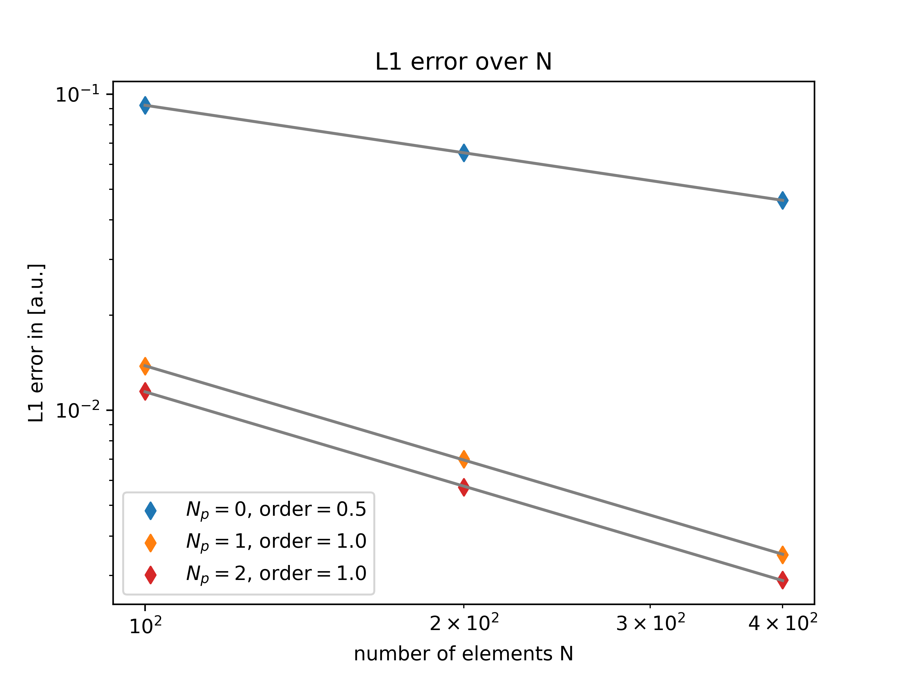

# hydro_bsc_project
Project to do hydrodynamics on cartesian and voronoi meshes. Includes Finite Volume MUSCL solver for shallow water and euler equations. Next steps are towards Discontinous Galerkin methods. Work in progress...

## Changes in last update
---
### Rayleigh Taylor instability
fixed initial conditions (pressure is now in hydrostatic equilibrium -> no more bouncing)

  
  

same triple plot tried for the quad shock simulation

  

---
## Discontinous Galerkin 1D scalar upwind advection

implemented 1d scalar upwind advection for arbitrary Np and monomial basisfunctions in C++ using Eigen library
even for very low resolution N = 20, the higher order schemes advect the initial condition quite well.

  
  
  

Seems like we need slope limiting next

## Slope limiting

  

works quite well for discontinuities

  

however slope limiting does more bad than good to already smooth solutions

  

therefore a more advanced slope limiting (e.g. better oscillation detection) would be nice but i guess thats for another project?

## L1-error comparison

  

the integral here is approximated numerically by a sum where we can choose the resolution

### L1 error of advected step function

  
  

- slope limiting again limits higher order methods to first order convergence at discontinuities and also limits the benefit of having higher order polynomials (e.g. compare Np = 1 vs Np = 2)
- interesting though that time evolution though is way less diffusive for the higher order methods? I guess we are not smoothing away structure after every step?

---
### next?
Question: Should we go 2D next? Or instead try to solve 1D SWE or Euler? I think 2D would be conceptually more interesting (e.g. nodal basis functions, more advanced mapping etc.). 1D on the other hand would allow for more comparison between Finite Volume and Discontinous Galerkin (L1 errors and so on)