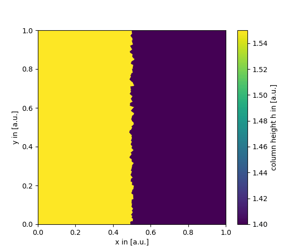
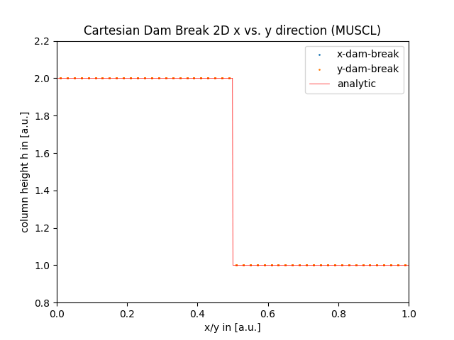
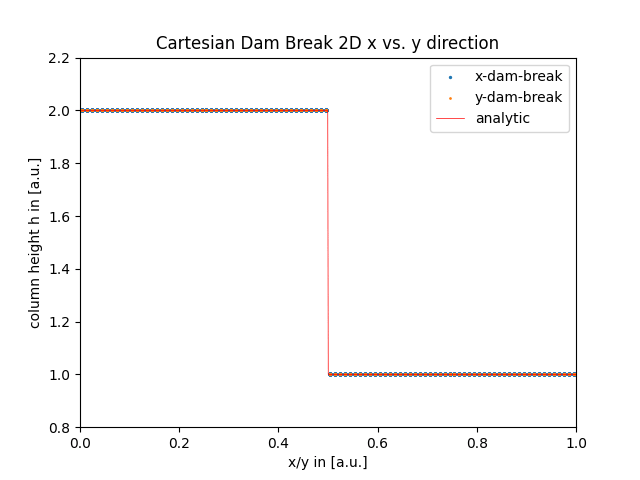
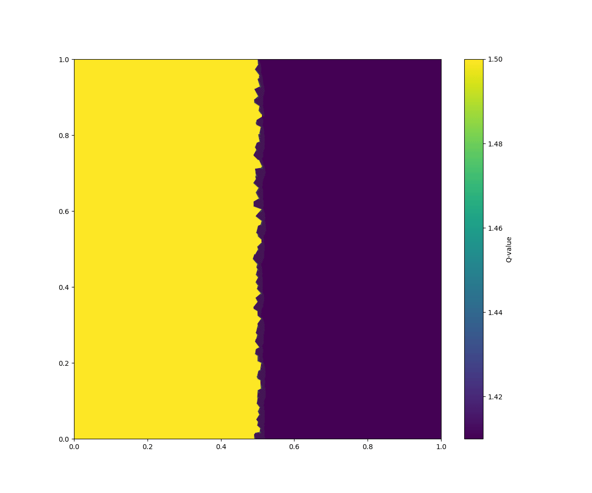
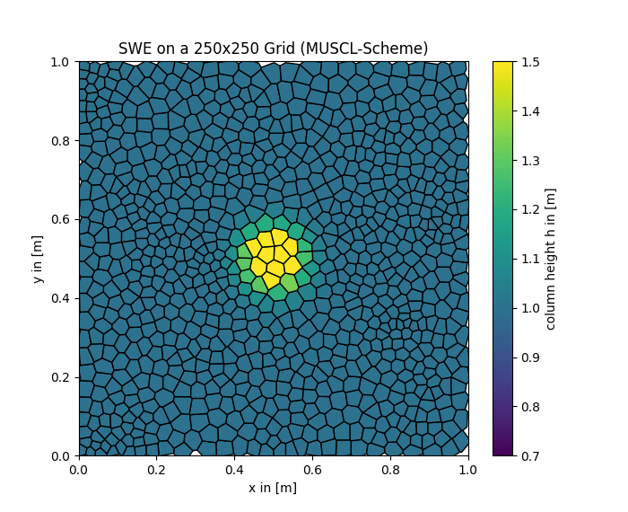
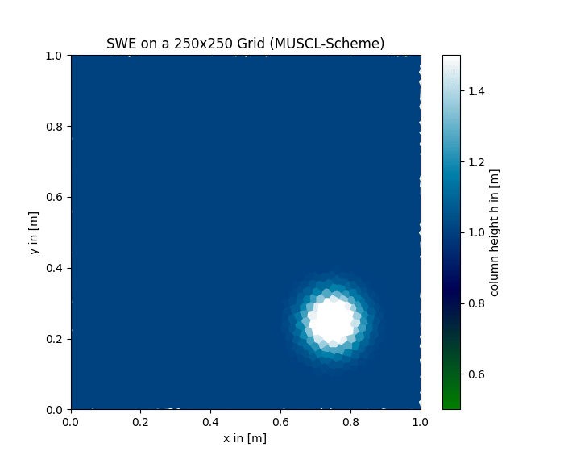
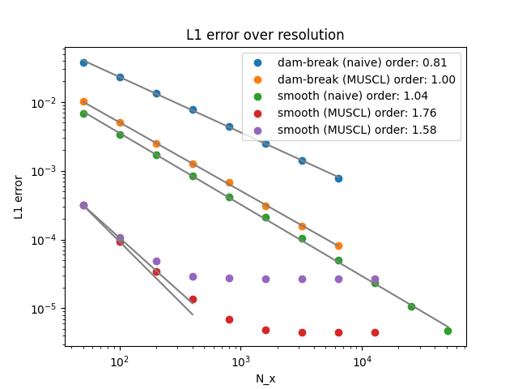

# hydro_bsc_project
Project to do hydrodynamics on cartesian and voronoi meshes.

Currently: Shallow Water first and second order FV solver (MUSCL), Advection

Will eventually also include a second order FV solver for euler equations and maybe a DG solver

## Changes in last update
---

- Huge code cleanup. Splitted main swe solver function into multiple subfunctions for the muscl solver focussing on readability
- Fixed Bug in linear extrapolation: leading to angular dependence for spherical symmetric solution and directed oscillations in dam break
- Fixed Bug that induced instability and crashes for periodic boundary conditions
- Found new favourite colormap "ocean" :D
- corrected log-fit procedure such that its a linear fit in log space better accounting for the errors in fitting
- made convergence plot against 1st-Order solution with very high resolution

---
### Bug1: Typo in linear extrapolation
Last time this looked suspicious. A rotational symmetric system producing something asymmetric? Additionally those oscillations in the dam break were travelling all in one direction despite y-symmetry here.

  
  

So i looked at cartesian dam-break in x and y direction to compare.

Left: clearly visible there is some bug. Those solutions should match very well!  Turns out it was an index typo in the linear extrapolation. Right: Fixed version looks as expected.

  
  

Asymmetry is now fixed. Oscillations in voronoi dam break now have no favourite direction and go up or down. I believe it is kind of expected this way?

  

---

### Bug 2: Proper scaling of centroids in periodic boundary conditions

  
  

Wierd bug happening when turning on periodic boundary conditions. 

- Algorithm worked for 1st Order periodic and also 2nd Order non periodic
- Instability however does not occur at boundaries itself??

Bug: Linear extrapolation is done starting from cell centroids. However for periodic boundary conditions i forgot to implement the rescaling of the centroid positions. Thus linear extrapolation from a completely wrong starting point leads to nonsense. Fixed by implementing corrected rescaling of cell centroid coordinates.

--- 

### Comparison Naive Algorithm vs MUSCL-Scheme

Two images at same 250x250 resolution (voronoi)

  
  

Inner boundary structures also still work (cartesian/voronoi with periodic outer boundary)

  
  

---

### Convergence for smooth solutions

Fixed fitting to linear fit in log-space for correct error estimation.
L1-error plot for 1D SWE against "analytical" solution (e.g. 1st Order Algorithm Solution with very high resolution : N = 102400).

  

- dam break convergence limited by slope-limiters
- naive algorithm scales to first order on smooth solutions
- MUSCL scheme scales with roughly ~1.7 for smooth solutions before approaching constant error due to method 
(-> MUSCL Solution there will be way better than best 1st Order Solution)

---

### next?

i guess MUSCL-Scheme for SWE works now?
move on to euler?

