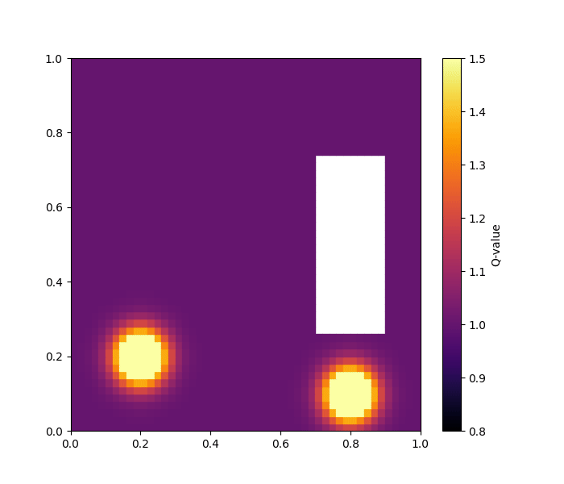
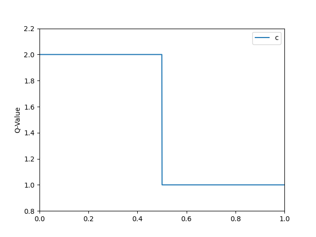
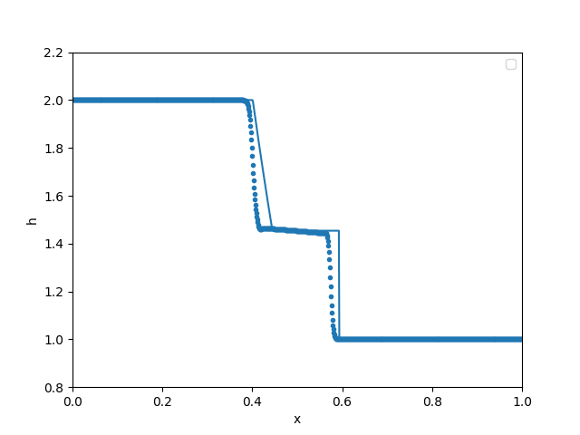
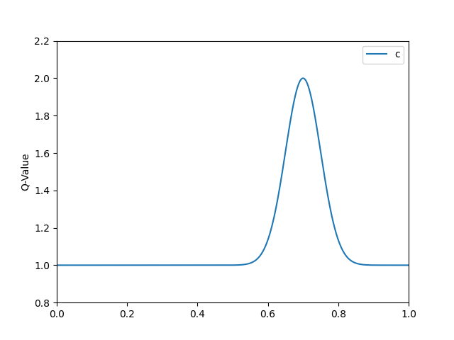

# hydro_bsc_project
project to eventually do hydrodynamics on different meshes, with maybe different physics and different solvers. still work in progress...

## Changes in last update
---
- implemented roes approximate riemann solver plus additional diffusion
- dam break problem 1D with analytical solution

---
### 2D Shallow water equations with Roe's approximate Riemann Solver

From last time we had:

$$ \vec{U}_i^{n+1} = \vec{U}_i^n + \frac{\Delta t}{A} \sum_{j \in \partial C_i}{\vec{F}_{i, j} \cdot l_{i,j}} $$

However it was unclear how $\vec{F}_{i,j}$ should look. Roe's approximate Riemann solver estimates the flux as

$$ \vec{F}_{roe} = \frac{1}{2} \Bigl( (f_in_x + g_in_y) + (f_jn_x + g_jn_y) - |A|(U_i - U_j) \Bigr)$$

with $A = \frac{\partial F}{\partial U} |_{roe}$ the flux jacobian evaluated at the roe average state. The roe average state is

$$ \tilde{h} = \sqrt{h_i h_j}, \;\;\;\tilde{c} = \sqrt{\frac{1}{2} \bigl(gh_i + gh_j  \bigr)} $$
$$ \tilde{u} = \frac{u_i \sqrt{h_i} + u_j\sqrt{h_j}}{\sqrt{h_i} + \sqrt{h_j}}, \;\;\; \tilde{v} = \frac{v_i \sqrt{h_i} + v_j\sqrt{h_j}}{\sqrt{h_i} + \sqrt{h_j}} $$

Calculating |A| leads to 

$$|A| = \lambda_1 \cdot \lambda_2 \cdot \lambda_3$$

with $\lambda_1 = \tilde{u}n_x + \tilde{v}n_y,\;\;\;  \lambda_2 = \tilde{u}n_x + \tilde{v}n_y - \tilde{c} ,\;\;\; \lambda_3 = \tilde{u}n_x + \tilde{v}n_y + \tilde{c}$

with that flux estimate we now can use the FV-Scheme.

Roe solver has little numerical diffusion, however for larger discontinuities it is unstable quite easily. Solution to that are adding additional diffusion or flux limiters. We start with additional diffusion and will take a look at flux limiters next time.
For stability we therefore will use

$$ \vec{F}_{roe,stable} = \vec{F}_{roe} -  \epsilon \cdot (U_i - U_j)$$

### 2D SWE on cartesian mesh

  
  

cartesian mesh, (50x50, epsilon = 0) and (200x200, epsilon = 0.1), reflective boundary

### 2D SWE on voronoi mesh

  
  

voronoi mesh, (50x50, epsilon = 0) and (200x200, epsilon = 0.1), reflective boundary

--- 
### Analytical Solution to 1D SWE: Dam Break Problem

Analytical solution:

  
  

Roe solver (no/little/much additional diffusion):

  
  
  

-> additional diffusion stabilizes system

Numerical solution rougly matches analytical one.

  

---
### Repeating, Reflective, Sink
Sanity check for boundary conditions with new flux

  
  
  

---
### Additional fun

  
  

---
still to do:

- Try to understand analytical solution i just copied for now
- Try flux limiter (e.g. superbee) instead of additional diffusion
- Implement HLL Solver version as well

further ideas:

- HLLC solver
- What about second order? (MUSCL-Hancock?), also slope limiter here
- Then decision on whether to progress with non constant ocean floor (e.g. source terms), start with Euler Equations or start DG already? I think Euler FV would make most sense but not sure